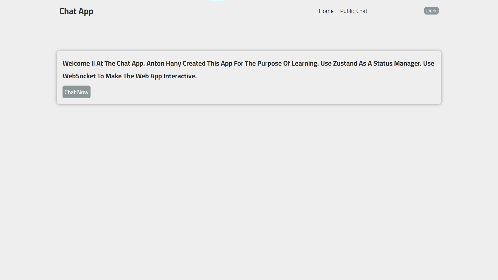
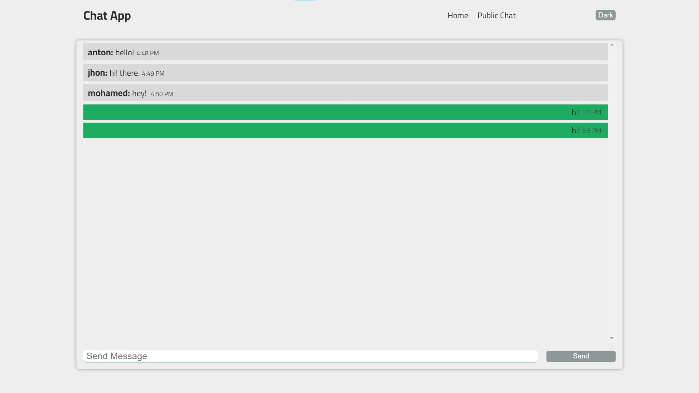

# Chat APP

### This project was created by Anton Hany

1- to learn some algorithms for real-time applications.

2- How does the server send data to all users connected to it without any http request?

---

### images

Login page 

Home page

Public chat page

---

### tools

